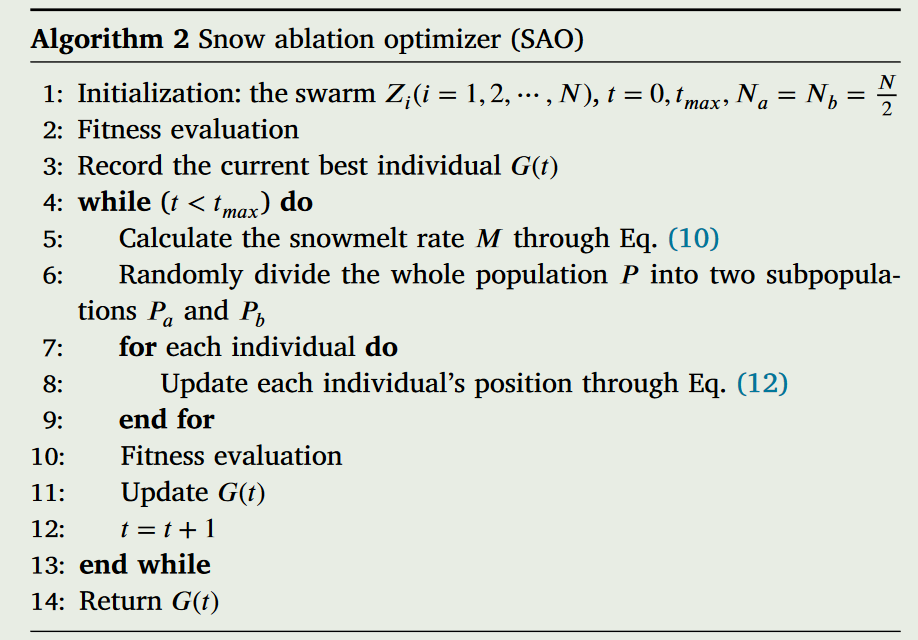
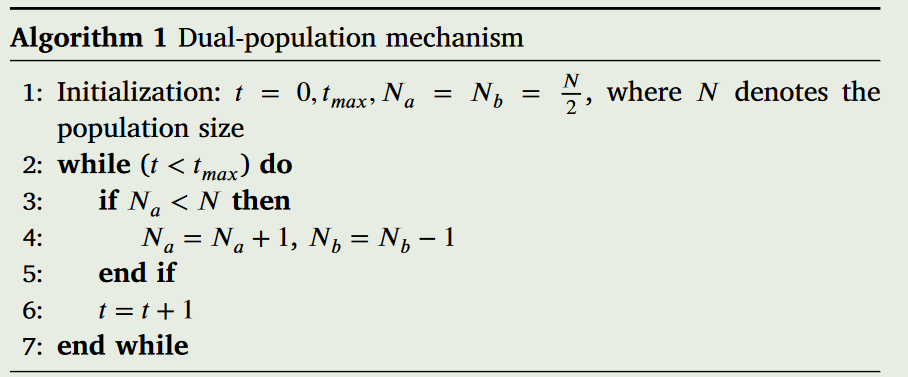
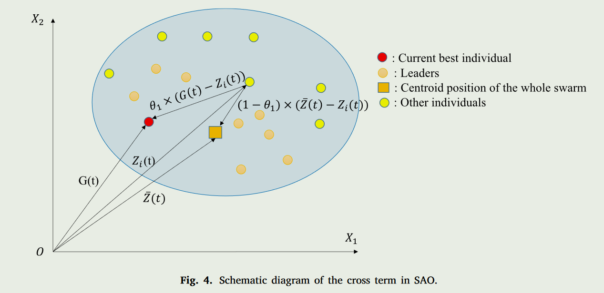
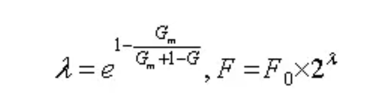
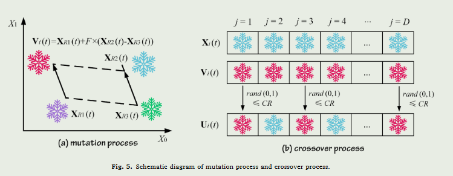
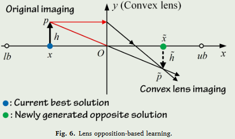
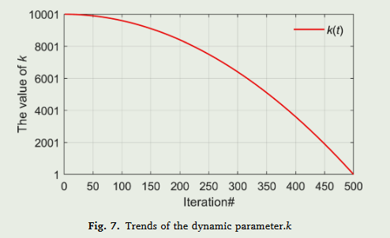
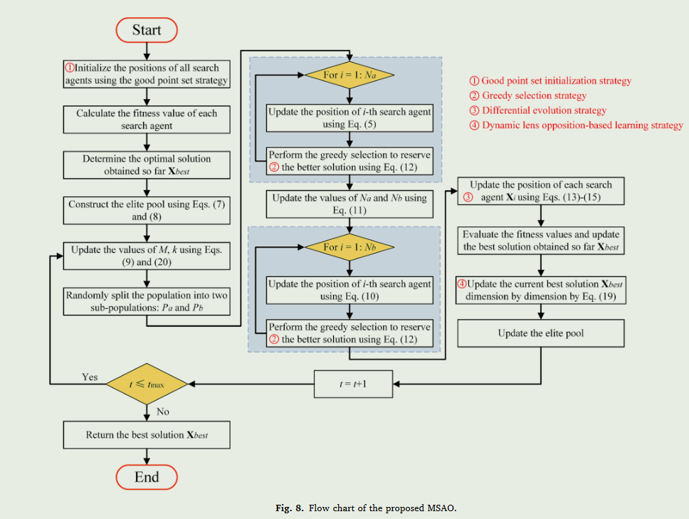
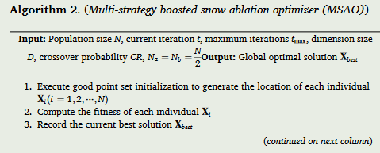
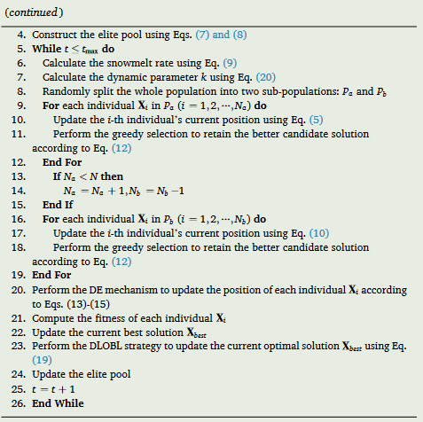

# 雪融优化算法

## 伪代码

# 初始化

在 SAO 中，迭代过程从随机生成的群体开始。如下所示，整个群体通常被建模为一个具有 N 行和 Dim 列的矩阵，其中 N 表示群体的大小，Dim 表示解空间的维数。

$$
\begin{aligned}&Z= L+\theta\times(U-L)\\&=\left[\begin{array}{ccccc}z_{1,1}&z_{1,2}&\cdots&z_{1,Dim-1}&z_{1,Dim}\\z_{2,1}&z_{2,2}&\cdots&z_{2,Dim-1}&z_{2,Dim}\\\vdots&\vdots&\vdots&\vdots&\vdots\\z_{N-1,1}&z_{N-1,2}&\cdots&z_{N-1,Dim-1}&z_{N-1,Dim}\\z_{N,1}&z_{N,2}&\cdots&z_{N,Dim-1}&z_{N,Dim}\end{array}\right]_{N\times Dim},\end{aligned}
$$

其中，L和U分别表示解空间的下界和上限。 θ表示\[0,1]中随机产生的一个数。

## 双种群机制

在元启发式算法中，实现利用和探索之间的权衡非常重要。一些由雪转化而来的液态水也可以转化为蒸汽来执行勘探过程。也就是说，随着时间的推移，个体进行具有高度分散特征的不规则运动的可能性增加。然后算法逐渐具有探索解空间的倾向。双种群机制就是为了反映这种情况并维持开采和勘探而设计的。如算法 1 所示，在迭代的早期阶段，整个种群被随机分为两个大小相等的子种群。我们将整个种群和这两个亚种群分别表示为 P 、 Pa 和 Pb 。另外，P、Pa、Pb的尺寸分别表示为N、Na、Nb。其中，Pa负责勘探，而Pb则被指定执行开采。然后在后续的迭代中，Pb的尺寸逐渐减小，Pa的尺寸相应增大。

## 种群更新方式

$$
\left.Z_i(t+1)=\left\{\begin{array}{c}Elite(t)+BM_i(t)\otimes(\theta_1\times(G(t)-Z_i(t))\\+(1-\theta_1)\times(\bar{Z}(t)-Z_i(t))),i\in index_a\\M\times G(t)+BM_i(t)\otimes(\theta_2\times(G(t)-Z_i(t))\\+(1-\theta_2)\times(\bar{Z}(t)-Z_i(t))),i\in index_b\end{array}\right.\right.
$$

### A种群   探索

$$
Z_i(t+1)=Elite(t)+BM_i(t)\otimes(\theta_1\times(G(t)-Z_i(t))\\+(1-\theta_1)\times(\bar{Z}(t)-Z_i(t)))
$$

其中，$Z_i(t)$表示第t次迭代期间的第i个个体，$BM_i(t)$表示基于高斯分布的随机数向量，表示布朗运动，符号$\otimes$表示逐项乘法，$\theta_1$表示数字从 \[0,1] 中随机选择。此外，G(t)指的是当前的最佳解，Elite(t)是从群体中的若干精英集合中随机选择的个体，$\bar{Z}(t)$表示整个群体的质心位置。相应的数学表达式如下

$$
\begin{aligned}&\bar{Z}(t)=\frac1N\sum_{i=1}^NZ_i(t)\\&Elite(t)\in[G(t),Z_{second}(t),Z_{third}(t),Z_{c}(t)]\end{aligned}
$$

其中$Z_second(t)$和$Z_third(t)$分别代表当前群体中第二好的个体和第三好的个体。 $Z_c(t)$表示适应度值排名前50%的个体的质心位置。在本研究中，为简单起见，将健身值排名前 50% 的个体称为领导者。此外，$Z_c(t)$是这么算滴捏

$$
Z_c(t)=\frac1{N_1}\sum_{i=1}^{N_1}Z_i(t),
$$

其中N1表示领导者的数量，即N1等于整个群体大小的一半，$Z_i(t)$表示第i个最佳领导者。

因此，在每次迭代期间，Elite(t)是从由当前最佳解决方案、第二最佳个体、第三最佳个体和领导者的质心位置组成的集合中随机选择的。

下图直观地描绘了二维参数空间中的交叉项$\theta_1\times(G(t)-Z_i(t))$和$(1-\theta_1)\times(\bar{Z}(t)-Z_i(t))$。参数$\theta_1$负责控制向当前最佳个体的移动以及向领导者质心位置的移动。上述两个交叉项的整合主要用来反映个体之间的相互作用。

### B种群   开发

$$
Z_i(t+1)=M\times G(t)+BM_i(t)\otimes(\theta_2\times(G(t)-Z_i(t))+\\(1-\theta_2)\times(Z(t)-Z_i(t)))
$$

其中M是融雪率，$\theta_2$表示从\[−1,1]中选择的随机数。该参数有利于个体之间的沟通。在此阶段，借助交叉项$\theta_2\times(G(t)-Z_i(t))$和$(1-\theta_1)\times(\bar{Z}(t)-Z_i(t))$，个体更有可能根据当前最佳搜索代理和群体质心位置的知识来开发有希望的区域。

然后在 SAO 中，利用以下公式计算融雪率：

$$
M=(0.35+0.25\times\frac{e^{\frac t{t_{\max}}}-1}{e-1})\times T(t),T(t)=e^{\frac{-t}{t_{\max}}}
$$

# 问题

收敛速度慢、种群多样性差以及开发与探索之间平衡不足的缺点

## SAO在处理一些非凸和高维数值优化任务时表现出求解精度和收敛速度不足。 SAO全局勘探趋势仍有进一步提升空间。

## SAO在面对现代复杂工程优化挑战时，由于存在大量的非线性约束，容易出现局部最优停滞现象。增强SAO的局部最优规避能力至关重要。

## 无免费午餐 (NFL) 定理意味着没有 MA 能够保证对所有优化应用都是可行的。

# 多策略增强

## 良好的点集初始化策略

采用良好的点集初始化策略生成均匀分布的高质量种群，有利于算法快速进入合适的搜索域。

群体的初始分布位置显着影响 MA 的全局收敛速度和最优解的质量。更加多样化和均匀的群体分布可以增强算法的优化性能\[82]。在SAO中，每个个体的初始位置由式（3）生成。 (3)采用随机数，构成随机初始化方式。不幸的是，这种方法不能保证种群多样性，并且常常使初始点远离最优解，从而影响收敛精度和搜索效率。作为一种旨在减少实验次数的实验方法，**佳点集理论**首先由Hua和Wang提出\[83]。根据参考文献\[84]，通过良好的点集方法生成的点位置比随机初始化更均匀地分布并且遍历整个解域。另外，好的点集序列的偏差阶只与解集的大小有关，而与解空间的维数无关，这为解决复杂的高维问题提供了理论支持。因此，本文采用良好的点集理论来初始化所有搜索代理的位置，从而增强多样性。其基本原理阐述如下：

设Gs为$s$维欧氏空间中的单位立方体，$r\in Gs$。若$\mathbf{P}_n(k)=\left\{\left(r_1^{(n)}\times k,\cdotp\cdotp\cdotp,r_i^{(n)}\times k,\cdotp\cdotp\cdotp,r_s^{(n)}\times k\right),1\leq k\leq n\right\}$且其偏差满足$\phi(n)=C(r,\varepsilon)n^{\varepsilon-1}$，其中$\varepsilon$表示任意正值$C(r,\varepsilon)$表示与r和$\varepsilon$相关的常数。然后$\mathbf{P}_n(k)$被定义为好点集，r表示好点。

取$r_k=\{2\mathrm{cos}(2\pi k/p),1\leq k\leq s\}$其中p表示满足$s\leq(p-3)/2$的最小素数，$\{r_i^{(n)}\times k\}1$表示$r_{i}^{(n)}\times k$的小数部分。

如果使用好的点集技术生成n个点，偏差为$O(n^{\varepsilon-1})$，仅与n有关，比随机方法小得多。为了更直观地比较随机初始化和良好点集初始化的分布，假设种群大小为 100，搜索域为 \[ 100, 100]，图 4 展示了它们在二维空间中的分布。可以看出，在相同条件下，随机种群的分布杂乱，有许多重叠的个体，而后者初始化的种群在搜索空间上分布更均匀，没有重叠的个体。因此，良好的点集初始化策略可以有效促进种群多样性，并在一定程度上提高SAO的全局搜索性能。

已知：种群所在的空间维度为n，种群数量为m

$step1:$计算$r$值，$r=(r_1,r_2,...r_n)$,其中$r_j=mod(2cos(\frac{2\pi j}7)m_i,1),1\leq j\leq n$。$m_i$表示第$i$个个体

$step2:$ 构造数量$m$的佳点集：

$$
P_n\left(i\right)=\left\{\left(r_1i_1,r_2i_2,...r_ni_n\right)\right\},i=1,2,3,...n
$$

$step3:$将$P_n$映射到种群所在的可行域上：

$$
X_i^j=a_j+P_n\left(i\right)(b_j-a_j)
$$

其中$a_j$表示当前维度的下限，$b_j$表示当前维度的上限

## 贪心选择策略

将贪婪选择技术添加到探索和利用过程中，以保留更好的个体进行下一次迭代，从而促进不同个体之间的信息交互，并建立良好的探索-利用权衡。

$$
\left.Z_i(t+1)=\left\{\begin{array}{c}Elite(t)+BM_i(t)\otimes(\theta_1\times(G(t)-Z_i(t))\\+(1-\theta_1)\times(\bar{Z}(t)-Z_i(t))),i\in index_a\\M\times G(t)+BM_i(t)\otimes(\theta_2\times(G(t)-Z_i(t))\\+(1-\theta_2)\times(\bar{Z}(t)-Z_i(t))),i\in index_b\end{array}\right.\right.
$$

基于上式，基本SAO在执行位置更新公式后将直接用新的候选解Xi(t+1)替换上一代解Xi(t)。然而，更新位置的适应度值不一定超过原始位置的适应度值，这可能会阻碍算法收敛到全局最优。在某些情况下，这可能会导致陷入局部最优甚至发散\[85]。贪心选择策略源于“适者生存”的思想，比较新生成的位置与原来的位置的适应度值，然后将每一代中的优越位置保留给下一次迭代，而较差的位置则保留给下一次迭代。被丢弃。该选择操作被表述为：

$$
\left.\mathbf{X}_{i}(t+1)=\left\{\begin{matrix}\mathbf{X}_{i}(t),\mathrm{if}f(\mathbf{X}_{i}(t))<f(\mathbf{X}_{i}(t+1))\\\mathbf{X}_{i}(t+1),\mathrm{otherwise}\end{matrix}\right.\right.
$$

其中f(•) 代表目标函数。通过将贪婪选择策略集成到MSAO中，其搜索能力可以更加鲁棒，因为每个保留的优秀个体将在后续搜索过程中与其他个体共享解空间信息。此外，有利于平衡勘探和开采趋势，推动MSAO产生更高质量的解决方案。

## 差分进化策略

实现了三个差分进化（DE）算子：交叉、变异和选择来更新所有个体的候选位置，以加强局部利用并扩大搜索区域，以换取更高的解决精度。

差分进化（DE）是一种随机搜索方法，已显示出其在解决不同实际应用任务中的广泛优化问题方面的有效性\[20]。在DE中，每个搜索代理被称为目标向量。在初始化期间，算法随机产生搜索域内的所有向量。然后，DE运行变异、交叉和选择算子来进化个体，直到满足终止标准。突变算子扰乱一组指定的目标向量以创建突变向量。交叉算子将该突变向量与其相应的目标向量组合以形成试验向量。最后，通过评估这些试验向量和目标向量的函数值，选择算子确定哪一个更优，并将其保留在下一代中。 \[86]。由于变异、交叉和选择算子可以强制种群多样性以避免过早收敛，因此 DE 已与许多 MA 混合以提高其开发能力和收敛精度 \[87,88]。本文将DE的进化过程嵌入到MSAO的基础框架中以提高优化性能。具体步骤如下：

(1)**变异操作**(DE/rand/1)。从种群中随机选择三个不同的个体，对其中两个个体之间的差距进行缩放，然后与第三个个体的位置相结合，创建一个新的突变个体。用数学术语来说，该运算可表示为：

$$
\mathbf{V}_i(t)=\mathbf{X}_{R1}(t)+F\times(\mathbf{X}_{R2}(t)-\mathbf{X}_{R3}(t)),R1\neq R2\neq R3
$$

其中 Vi(t) 表示变异个体，R1、R2、R3是三个随机索引$\in {1,2,⋯,N}$。 F表示突变尺度因子，$F = F_0\times2e^{t/{1-t_{\max}}}$，F0等于0.5。

(2)**交叉操作**。变异完成后，交叉操作将使用指定的交叉概率，通过以二进制形式混合原始目标向量和变异向量来创建试验向量。

$$
\left.U_{i,j}(t)=\left\{\begin{array}{c}V_{i,j}(t),\mathrm{if~}rand(0,1)\leqslant CR\mathrm{~or~}j=j_{rand}\\X_{i,j}(t),\mathrm{otherwise}\end{array}\right.\right.
$$

其中 CR ∈\[ 0, 1] 表示交叉可能性。在本研究中，CR = 0.8，如何达到这个值将在第 4 节中证明。 Xi,j(t) 表示第 i 个搜索代理在第 j 维中的贡献.$j_{rand}$表示一个随机整数$\in { 1, 2,⋯, D}$，它保证 Ui(t) 从 Vi(t) 中获得至少一个参数。

(3)**选择操作**。这里同样采用贪婪准则来评估是否应将相应的目标向量Xi(t)替换为试验向量Ui(t)。在最小化问题的情况下，选择方案在下式中定义。

$$
\mathbf{X}_i(t+1)\leftarrow\left\{\begin{array}{c}\mathbf{U}_i(t),\mathrm{if~}f(\mathbf{U}_i(t))\leqslant f(\mathbf{X}_i(t))\\\mathbf{X}_i(t),\mathrm{otherwise}\end{array}\right.
$$

如果 Ui(t) 与Xi(t)，在后续迭代中仍为 Xi(t + 1)。否则，保留现有目标向量Xi(t)。图5说明了变异过程和交叉过程的原理。通过将MSAO与DE策略相结合，进一步增加了搜索范围和种群多样性，从而避免了局部最优停滞并提高了收敛精度。

## 动态透镜反对学习策略

为了降低陷入局部最优的风险，开发了动态透镜反对学习（DLOBL）策略，逐维对当前最优解进行操作。

为了最大化SAO逃离局部最优的可能性，提出了一种新颖的动态透镜反对学习（DLOBL）策略，以在后期从相反方向扰动当前最优解。

在传统SAO中的方程（5）和（10）的基础上，通过引导当前个体到全局最优点（Xbest）生成新的候选解。随着优化过程的进展，群体中的大多数个体倾向于聚集在感知的当前最优值附近。因此，SAO 很容易出现过早收敛的情况。增强 SAO 的首要研究重点是**提高其规避局部最优**的能力。为了加强 MA 的全局探索，现有文献中一种流行的方法是**基于反对的学习**（OBL）\[89]。 OBL植根于同时计算当前个体的目标值及其逆解，旨在揭示对优化目标更有利的最优解。阮等人 \[90]将OBL机制引入粘菌算法中，以避免局部最优，为梯田水电站的优化运行提供更好的优化性能。赵等人 \[91]提出了一种 COLMA 方法，利用 OBL 来增强蜉蝣优化器的探索能力。

**基于透镜对立的学习**（LOBL）是 OBL 的创新变体，它模拟光学定律中凸透镜成像的现象。具体来说，当物体放置在凸透镜两倍焦距处时，在透镜的另一侧将形成倒立且缩小的实像。在图6的二维空间中，点O表示搜索区间\[lb，ub]的中点，并且y轴被概念化为凸透镜。假设：高度为 h 的搜索个体在图像区域在 x 轴上的投影标记为 x（蓝点），它位于距镜头两倍焦距的位置。镜头成像后，产生高度为 ̃h 的实像，其在 x 轴上的投影表示为 ̃x（绿点）。根据镜头成像原理，可以

$$
\frac{(lb+ub)/2-x}{\widetilde{x}-(lb+ub)/2}=\frac h{\widetilde{h}}
$$

设$k=h/\widetilde{h}$，则式上式变为

$$
\widetilde{x}=\frac{lb+ub}2+\frac{lb+ub}{2k}-\frac xk
$$

当k等于1时，式可以转化为 OBL 的标准形式如下：

$$
\widetilde{x}=lb+ub-x
$$

这表明 OBL 只是 LOBL 的一个特例，它不仅继承了 OBL 的优点，而且还可以促进求解多样性以及通过调整 k 值逃离局部最优的可能性。扩展方程到D维空间表示为：

$$
\widetilde{x}_{i,j}=\frac{lb_j+ub_j}2+\frac{lb_j+ub_j}{2k}-\frac{x_{i,j}}k
$$

其中$\widetilde{x}_{i,j}$表示第$i$个个体第$j$维的相反解。$lb_j$和$ub_j$分别表示第$j$维的上边界和下边界。

在基本的 LOBL 中，k 被分配一个常数值，这限制了它在整个迭代过程中适应和创建不同解决方案的能力 \[92]。通常，该算法强调在初始迭代中对搜索空间进行全面探索，以发现具有最佳解决方案的有希望的区域。此时，k的值可以设置得稍大一些，以促进更广泛的搜索广度和群体多样性。在后期阶段，可以使用较小的k值来增强算法的局部搜索有效性，以获得更精确的最优解。因此，本文提出了一种**非线性动态递减机制来调整k的值**：

$$
k=10^4\times\left[1-\left(\frac{t}{t_{\max}}\right)^2\right]+1
$$

其中t表示当前迭代，tmax表示最大迭代次数。下图描绘了k的趋势。一旦所有基本程序都执行完毕，所提出的动态透镜反对学习（DLOBL）机制将被应用于逐维逐步调整当前最优解（Xbest），使其更接近理论最优解并加速收敛。

## 动态种群策略

陷入局优时增加探索种群的数量，这里选择直接将探索种群置满，开发种群置0

# 详细实现

引入初始化策略来生成均匀分布的高质量种群以进行全局搜索。然后，在勘探和开发阶段实施贪婪选择策略，以增强鲁棒性并建立适当的勘探-开发平衡。接下来，采用DE机制来增强开发能力，以获得较高的收敛精度。最后，开发DLOBL来更新当前最优解以避免局部停滞。 MSAO 的详细步骤如下所示。

**步骤1：**初始化参数：种群规模N、最大迭代次数tmax、变量维度D、搜索范围\[Lb,Ub]、交叉概率CR。设置当前迭代t=1；

**步骤2：**使用良好的点集初始化策略生成每个个体Xi(i = 1, 2, ⋯, N)的位置；

**步骤3：**评估每个搜索代理的适应度值，记录最优解Xbest，然后利用下式构建精英池

$$
\mathbf{X}_{elite}(t)\in[\mathbf{X}_{best}(t),\mathbf{X}_{second}(t),\mathbf{X}_{third}(t),\mathbf{X}_{c}(t)]
$$

$$
\mathbf{X}_c(t)=\frac{1}{N_1}\sum_{i=1}^{N_1}\mathbf{X}_i(t)
$$

**步骤4：**当$t<t_{max}$时，分别用下式计算融雪率M和参数k

$$
M=(0.35+0.25\times\frac{e^{\frac t{t_{\max}}}-1}{e-1})\times T(t),T(t)=e^{\frac{-t}{t_{\max}}}
$$

$$
k=10^4\times\left[1-\left(\frac{t}{t_{\max}}\right)^2\right]+1
$$

**步骤5：**将整个总体随机分为Pa和Pb。使用下式更新 Pa 中每个个体 Xi(i = 1, 2, ⋯, Na) 的位置

$$
\begin{aligned}\mathbf{X}_{i}(t+1)&=\mathbf{X}_{elite}(t)+\mathbf{BM}_{i}(t)\otimes(r_{1}\times(\mathbf{X}_{best}(t)-\mathbf{X}_{i}(t))+(1-r_{1})\\&\times(\mathbf{X}_{mean}(t)-\mathbf{X}_{i}(t)))\end{aligned}
$$

使用贪婪选择策略比较新生成的解决方案和原始解决方案之间的适应度并保留其中较好的一个。

$$
\left.\mathbf{X}_{i}(t+1)=\left\{\begin{matrix}\mathbf{X}_{i}(t),\mathrm{if}f(\mathbf{X}_{i}(t))<f(\mathbf{X}_{i}(t+1))\\\mathbf{X}_{i}(t+1),\mathrm{otherwise}\end{matrix}\right.\right.
$$

如果 Na 小于 N，则 Na = Na + 1，Nb = Nb-1。

使用下式更新 Pb 中每个个体 Xi(i = 1, 2, ⋯, Nb) 的位置。

$$
\begin{aligned}\mathbf{X}_{i}(t+1)&=M(t)\times\mathbf{X}_{best}(t)+\mathbf{B}\mathbf{M}_{i}(t)\otimes(r_{2}\times(\mathbf{X}_{best}(t)-\mathbf{X}_{i}(t))+(1-r_{2})\\&\times(\mathbf{X}_{mcan}(t)-\mathbf{X}_{i}(t)))\end{aligned}
$$

使用贪婪选择策略比较新生成的解决方案和原始解决方案之间的适应度并保留其中较好的；

**步骤6：**依次使用变异、交叉、选择算子更新种群Xi(i = 1, 2, ⋯, N)的位置，即下式

(1)**变异操作**(DE/rand/1)。从种群中随机选择三个不同的个体，对其中两个个体之间的差距进行缩放，然后与第三个个体的位置相结合，创建一个新的突变个体。用数学术语来说，该运算可表示为：

$$
\mathbf{V}_i(t)=\mathbf{X}_{R1}(t)+F\times(\mathbf{X}_{R2}(t)-\mathbf{X}_{R3}(t)),R1\neq R2\neq R3
$$

其中 Vi(t) 表示变异个体，R1、R2、R3是三个随机索引$\in {1,2,⋯,N}$。 F表示突变尺度因子，$F = F_0\times2e^{t/{1-t_{\max}}}$，F0等于0.5。

(2)**交叉操作**。变异完成后，交叉操作将使用指定的交叉概率，通过以二进制形式混合原始目标向量和变异向量来创建试验向量。

$$
\left.U_{i,j}(t)=\left\{\begin{array}{c}V_{i,j}(t),\mathrm{if~}rand(0,1)\leqslant CR\mathrm{~or~}j=j_{rand}\\X_{i,j}(t),\mathrm{otherwise}\end{array}\right.\right.
$$

其中 CR ∈\[ 0, 1] 表示交叉可能性。在本研究中，CR = 0.8，如何达到这个值将在第 4 节中证明。 Xi,j(t) 表示第 i 个搜索代理在第 j 维中的贡献.$j_{rand}$表示一个随机整数$\in { 1, 2,⋯, D}$，它保证 Ui(t) 从 Vi(t) 中获得至少一个参数。

(3)**选择操作**。这里同样采用贪婪准则来评估是否应将相应的目标向量Xi(t)替换为试验向量Ui(t)。在最小化问题的情况下，选择方案在下式中定义。

$$
\mathbf{X}_i(t+1)\leftarrow\left\{\begin{array}{c}\mathbf{U}_i(t),\mathrm{if~}f(\mathbf{U}_i(t))\leqslant f(\mathbf{X}_i(t))\\\mathbf{X}_i(t),\mathrm{otherwise}\end{array}\right.
$$

如果 Ui(t) 与Xi(t)，在后续迭代中仍为 Xi(t + 1)。否则，保留现有目标向量Xi(t)。

**步骤7：**重新计算每个个体的适应度，更新最优解Xbest；

**步骤8：**执行DLOBL策略，使用下式逐维更新当前最优解Xbest然后，更新精英库；

$$
\widetilde{x}_{i,j}=\frac{lb_j+ub_j}2+\frac{lb_j+ub_j}{2k}-\frac{x_{i,j}}k
$$

**步骤9：**设t=t+1，若t≤tmax，则转步骤4，若否，则输出全局最优解Xbest。建议的 MSAO 的流程图如图 8 所示。

算法 2 概述了 MSAO 的伪代码。

# 多目标优化

## 加权求和

## 有优先级

### 序贯解法

## 无优先级

### 理想点法

### 非支配排序

类似NSGA-II

# 优化超参数
